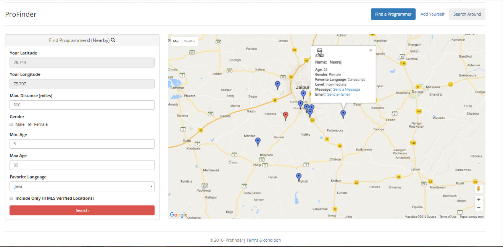
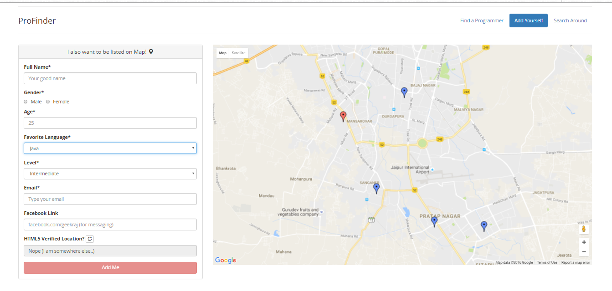

# ProPartner

This project was build during a campus hackathon in my college. We had given to build something unique so I tried to locate people on Google Map. 

This app helps you to find programmers around your location or anywhere in the world accourding to filters. Even you can add yourself to this app so that other programmers near your home could find you and contact you in case of any programming related help or maybe to work on something cool.

<h2>Demo</h2>
Deployed on heruku for demonstration purpose. find Demo <a href="https://propartner.herokuapp.com/" target="_blank">here</a>

<h2>Features</h2>

<ul>
<li> Works in Real Time. No page refreshing..and time consuming things</li>
<li> Add yourself to the map and find other programmers</li>
<li> Automatic location detection using geolocation. So that you couldn't fake your address.</li>
<li> You can add you social profile.</li>
</ul>

<h2>Tools and Stack used</h2>

<ul>
<li> AngularJs</li>
<li> NodeJs</li>
<li> MongoDB</li>
<li> AngularJs</li>
<li> <a href="https://developers.google.com/maps/documentation/javascript/">Google Maps Javascript API</a></li>
<li> Bootstrap</li>

</ul>

<h2>How to download and run on your system</h2>

<ul>
<li> Clone the repository
<pre> git clone url</pre>
</li>

<li> Install dependencies
<pre> npm install</pre>
</li>

<li> Run
<pre> gulp serve</pre>
</li>

</ul>

